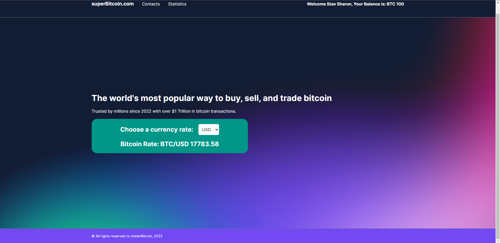
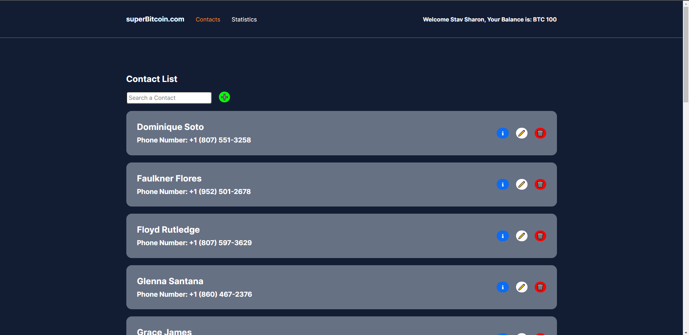
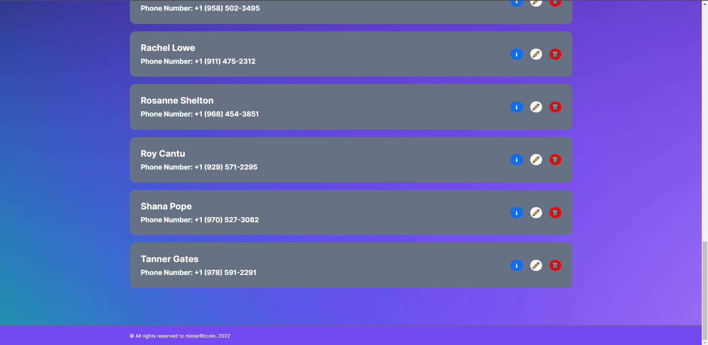
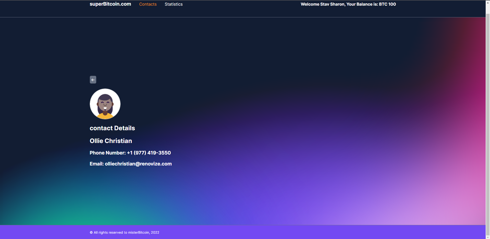
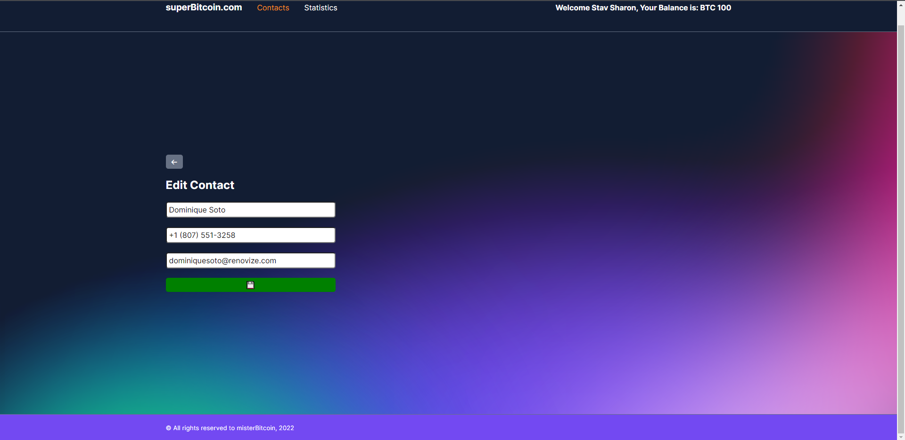
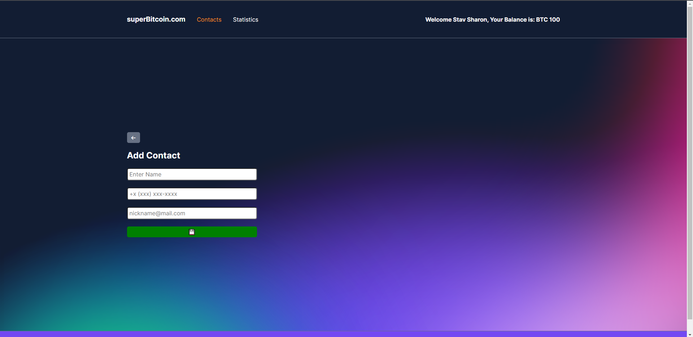
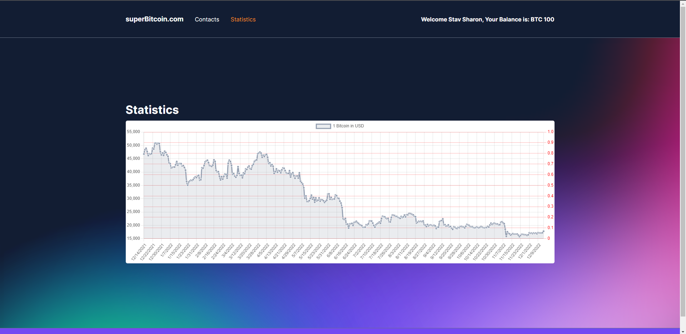

# Super Bitcoin

### A digital wallet app for keeping and transfering Bitcoins.
<br/> 

### Main Technologies:
<a href="https://www.w3schools.com/html/" target="_blank" rel="noreferrer"> 
     
</a>
<a href="https://sass-lang.com" target="_blank" rel="noreferrer"> 
     
</a>  
<a href="https://www.typescriptlang.org/" target="_blank" rel="noreferrer"> 
     
</a> 
<a href="https://angular.io" target="_blank" rel="noreferrer"> 
     
</a> 

<br/> 

### Key Features:
1. A logged in user can transfer Bitcoins from his balance to any of his contacts.
2. The user can edit, add and remove contacts.
3. The app uses an API to fetch and display information about the trade volume and exchange rate of Bitcoin.

## App Pages
<br/>

### 1. Home Page
<br/>

<br/>
<br/>

<br/>
<br/>

### 2. Contacts Page
<br/>

<br/>
<br/>

<br/>
<br/>

<br/>
<br/>

<br/>
<br/>

### 3. Contact Info Example Page
<br/>

<br/>
<br/>

<br/>
<br/>

### 4. Contact Add/Edit Page
<br/>

#### Edit Page
<br/>

<br/>
<br/>

<br/>
<br/>

#### Add Page
<br/>

<br/>
<br/>

<br/>
<br/>

### 5. Statistics Page
<br/>

<br/>
<br/>

<br/>
<br/>

## Development server

This project was generated with [Angular CLI](https://github.com/angular/angular-cli) version 14.2.6.

### Project Setup

```sh
npm install
```

Run `ng serve` for a dev server. Navigate to `http://localhost:4200/`. The application will automatically reload if you change any of the source files.

## Code scaffolding

Run `ng generate component component-name` to generate a new component. You can also use `ng generate directive|pipe|service|class|guard|interface|enum|module`.

## Build

Run `ng build` to build the project. The build artifacts will be stored in the `dist/` directory.

## Running unit tests

Run `ng test` to execute the unit tests via [Karma](https://karma-runner.github.io).

## Running end-to-end tests

Run `ng e2e` to execute the end-to-end tests via a platform of your choice. To use this command, you need to first add a package that implements end-to-end testing capabilities.

## Further help

To get more help on the Angular CLI use `ng help` or go check out the [Angular CLI Overview and Command Reference](https://angular.io/cli) page.
